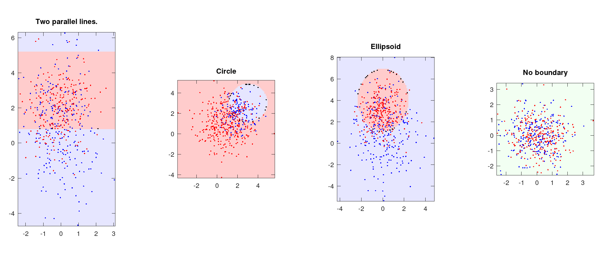

## Assignment#1

### 1. Machine learning problem
**(a)**
1) BF
2) C
3) C
4) BG
5) AE
6) AD
7) BF
8) AE
9) BF

**(b)**
Answer: **This is definite False.** If you just choose parameters which performs best on whole dataset, it may cause the **overfitting problem or high variance**, that is to say your model's generalization ability is low. So it's better to split the dataset into **training set、cross-validation set and test set**, we train our model parameters from training set that performs best on cross-validation set, meanwhile use the test set to examine the generalization ability of your model.

---

### 2. Bayes Decision Rule
**(a)**
- (i) Since we just have 3 boxes, so: $$P(B_1 = 1) = \frac{1}{3}$$
- (ii) Since we just have 1 box containes the bonus, so: $$P(B_2 = 0 \mid B_1 = 1) = 1$$
- (iii) From Bayes formula, we can get that: $$P(B_1 = 1 \mid B_2 = 0) = \frac{P(B_2 = 0 \mid B_1 = 1) \cdot P(B_1 = 1)}{P(B_2 = 0)} = \frac{1\ast(\frac{1}{3})}{(\frac{2}{3})} = \frac{1}{2}$$
- (iv) Since the $B_1$ and $B_3$ has no direct association, so that can get:$$P(B_1 = 1 \mid B_2 = 0) = P(B_3 = 1 \mid B_2 = 0) = \frac{1}{2}$$
That's to say, the probability of $B_1$ or $B_3$ that contains the bonus is just the same! So you can either choose stick to $B_1$ or choose the left box $B_3$, both are optimal choice.

**(b)**
- (i) The distribution of $P(x \mid \omega_i)$ is shown below:

        Using the maximum likelihood decision rule,the test error is 64.

- (ii) The distribution of $P(\omega_i \mid x)$ is shown below:

        Using optimal bayes decision rule, the test error is 47.

- (iii) The minimum total risk $(R = \sum_xmin_iR(\alpha_i \mid x))$ we calculate the result is **2.444354**

---

### 3. Gaussian Discriminant Analysis and MLE
- (a)

First from Beyaes formula, we can get that:
$$p(y=1\mid\mathtt{x})=\frac{p(\mathtt{x}\mid y=1)\cdot p(y=1)}{p(\mathtt{x})}=\frac{p(\mathtt{x}\mid y=1)\cdot p(y=1)}{\sum_{i=0}^{1}p(\mathtt{x}\mid y=i)\cdot p(y=i)} \tag{1}$$

Since $p(y=0)=p(y=1)=\phi=\frac{1}{2}$, so from $(1)$ we can produce:
$$p(y=1\mid\mathtt{x})= \frac{1}{1+\frac{p(\mathtt{x}\mid y=0)\cdot p(y=0)}{p(\mathtt{x}\mid y=1)\cdot p(y=1)}} = \frac{1}{1+\frac{p(\mathtt{x}\mid y=0)}{p(\mathtt{x}\mid y=1)}}\tag{2}$$

Until now, our target is to calculate $\frac{p(\mathtt{x}\mid y=0)}{p(\mathtt{x}\mid y=1)}$, we start from calculate $p(\mathtt{x}\mid y=0)$:
$$p(\mathtt{x}\mid y=0)=\frac{1}{2\pi \sqrt{|\Sigma_0|}}\cdot e^{-\frac{1}{2}(\mathtt{x}-\mu_0)^T \Sigma_0^{-1}(\mathtt{x}-\mu_0)} \tag{3}$$

we already know that $\Sigma_0=\begin{pmatrix}1&0\\0&1\end{pmatrix}$ and $\mu_0=(0, 0)^T$,so easy to know $|\Sigma_0|=1$ and $\Sigma_0^{-1}=\begin{pmatrix}1&0\\0&1\end{pmatrix}$, take these into $(3)$:
$$p(\mathtt{x}\mid y=0)=\frac{1}{2\pi}e^{-\frac{1}{2}\begin{bmatrix}x_1&x_2\end{bmatrix}\cdot \begin{bmatrix}1&0\\0&1\end{bmatrix}\cdot\begin{bmatrix}x_1\\x_2\end{bmatrix}}=\frac{1}{2\pi}e^{-\frac{1}{2}(x_1^2+x_2^2)} \tag{4}$$

The same way for $y=1$, we can get formula below:
$$p(\mathtt{x}\mid y=1)=\frac{1}{2\pi}e^{-\frac{1}{2}[(x_1-1)^2+(x_2-1)^2]} \tag{5}$$

Take $(4)(5)$ back to $(2)$, we can get final result:
$$p(y=1\mid \mathtt{x};\phi,\mu_0,\mu_1,\Sigma_0,\Sigma_1)=\frac{1}{1+\frac{p(\mathtt{x}\mid y=0)}{p(\mathtt{x}\mid y=1)}}=\frac{1}{1+e^{1-x_1-x_2}} \tag{6}$$

So far, we continue to go on to get the **decision boundary:**, using the same way calculate that $P(y=0\mid \mathtt{x})=\frac{1}{1+e^{x_1+x_2-1}}$, we let $p(y=0\mid \mathtt{x})=p(y=1\mid \mathtt{x})$, then we get the **decision boundary also discrimant plane**: **$x_1+x_2=1$**. When $x_1+x_2<1\implies p(y=0\mid \mathtt{x})>p(y=1\mid \mathtt{x}).$ When $x_1+x_2>1\implies p(y=1\mid \mathtt{x})>p(y=0\mid \mathtt{x}).$

- (b): See the codes in folder.
- (c): The result plots shown below:

