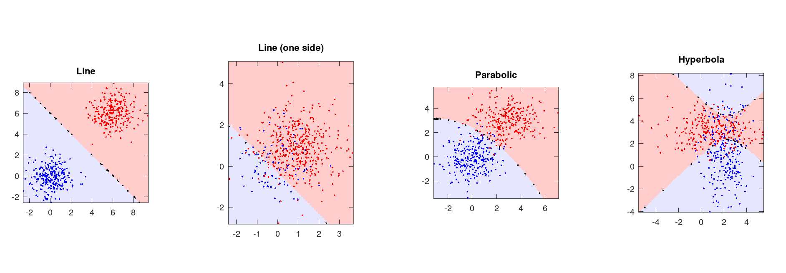

## Assignment1

### 1. Machine learning problem
**(a)**
1) BF
2) C
3) C
4) BG
5) AE
6) AD
7) BF
8) AE
9) BF

**(b)**
Answer: **This is definite False.** If you just choose parameters which performs best on whole dataset, it may cause the **overfitting problem or high variance**, that is to say your model's generalization ability is low. So it's better to split the dataset into **training set、cross-validation set and test set**, we train our model parameters from training set and choose the parameters which performs best on cross-validation set, meanwhile use the test set to examine the generalization ability of your model.

---

### 2. Bayes Decision Rule
**(a)**
- (i) Since we just have 3 boxes, so: $$P(B_1 = 1) = \frac{1}{3}$$
- (ii) Since we just have 1 box containes the bonus, so: $$P(B_2 = 0 \mid B_1 = 1) = 1$$
- (iii) From Bayes formula, we can get that: $$P(B_1 = 1 \mid B_2 = 0) = \frac{P(B_2 = 0 \mid B_1 = 1) \cdot P(B_1 = 1)}{P(B_2 = 0)} = \frac{1\ast(\frac{1}{3})}{(\frac{2}{3})} = \frac{1}{2}$$
<br>
- (iv) Since the $B_1$ and $B_3$ has no direct association, so that can get:$$P(B_1 = 1 \mid B_2 = 0) = P(B_3 = 1 \mid B_2 = 0) = \frac{1}{2}$$
That's to say, the probability of $B_1$ or $B_3$ that contains the bonus is just the same! So you can either choose stick to $B_1$ or choose the left box $B_3$, both are optimal choice.

**(b)**
- (i) The distribution of $P(x \mid \omega_i)$ is shown below:


        Using the maximum likelihood decision rule,the number of 
        misclassfied x also test error is 64.

- (ii) The distribution of $P(\omega_i \mid x)$ is shown below:


        Using optimal bayes decision rule, the number of 
        misclassfied x also the test error is 47.

- (iii) The minimum total risk $(R = \sum_xmin_iR(\alpha_i \mid x) = \sum_xmin_i \lambda(\alpha_i \mid \omega_j) \cdot p(\omega_j \mid x))$, here we know the loss matrix $\lambda(\alpha_i \mid \omega_j)$, and if take the training set posterior $p_{train}(\omega_j \mid x)$ into the formula, I calculate the result is **2.444354**, if take the test set $p_{test}(\omega_j \mid x)$ into formula, I first retrive the both 0 columns and get result is **2.178660**. The codes shown below, also can see in the code folder:
```matlab
% p is the posterior of training set
risk = [0, 1; 2, 0];
matrix_omega_1 = sum(p .* risk(1, :)');
matrix_omega_2 = sum(p .* risk(2, :)');
matrix_min = min(matrix_omega_1, matrix_omega_2);
risk_min = sum(matrix_min);
fprintf("The minimum risk for training set is %f\n", risk_min);

% use test set to calculate risk
% retrive both 0 columns
p = posterior(test_x(:, 4:size(test_x, 2) - 1));
matrix_omega_1 = sum(p .* risk(1, :)');
matrix_omega_2 = sum(p .* risk(2, :)');
matrix_min = min(matrix_omega_1, matrix_omega_2);
risk_min = sum(matrix_min);
fprintf("The minimum risk for test set is %f\n", risk_min);
```

---

<br><br>
### 3. Gaussian Discriminant Analysis and MLE
- **(a)**

First from Beyaes formula, we can get that:
$$p(y=1\mid\mathtt{x})=\frac{p(\mathtt{x}\mid y=1)\cdot p(y=1)}{p(\mathtt{x})}=\frac{p(\mathtt{x}\mid y=1)\cdot p(y=1)}{\sum_{i=0}^{1}p(\mathtt{x}\mid y=i)\cdot p(y=i)} \tag{1}$$

Since $p(y=0)=p(y=1)=\phi=\frac{1}{2}$, so from $(1)$ we can produce:
$$p(y=1\mid\mathtt{x})= \frac{1}{1+\frac{p(\mathtt{x}\mid y=0)\cdot p(y=0)}{p(\mathtt{x}\mid y=1)\cdot p(y=1)}} = \frac{1}{1+\frac{p(\mathtt{x}\mid y=0)}{p(\mathtt{x}\mid y=1)}}\tag{2}$$

Until now, our target is to calculate $\frac{p(\mathtt{x}\mid y=0)}{p(\mathtt{x}\mid y=1)}$, we start from calculate $p(\mathtt{x}\mid y=0)$:
$$p(\mathtt{x}\mid y=0)=\frac{1}{2\pi \sqrt{|\Sigma_0|}}\cdot e^{-\frac{1}{2}(\mathtt{x}-\mu_0)^T \Sigma_0^{-1}(\mathtt{x}-\mu_0)} \tag{3}$$

we already know that $\Sigma_0=\begin{pmatrix}1&0\\0&1\end{pmatrix}$ and $\mu_0=(0, 0)^T$,so easy to know $|\Sigma_0|=1$ and $\Sigma_0^{-1}=\begin{pmatrix}1&0\\0&1\end{pmatrix}$, take these into $(3)$:
$$p(\mathtt{x}\mid y=0)=\frac{1}{2\pi}e^{-\frac{1}{2}\begin{bmatrix}x_1&x_2\end{bmatrix}\cdot \begin{bmatrix}1&0\\0&1\end{bmatrix}\cdot\begin{bmatrix}x_1\\x_2\end{bmatrix}}=\frac{1}{2\pi}e^{-\frac{1}{2}(x_1^2+x_2^2)} \tag{4}$$

The same way for $y=1$, we can get formula below:
$$p(\mathtt{x}\mid y=1)=\frac{1}{2\pi}e^{-\frac{1}{2}[(x_1-1)^2+(x_2-1)^2]} \tag{5}$$

Take $(4)(5)$ back to $(2)$, we can get final result:
$$p(y=1\mid \mathtt{x};\phi,\mu_0,\mu_1,\Sigma_0,\Sigma_1)=\frac{1}{1+\frac{p(\mathtt{x}\mid y=0)}{p(\mathtt{x}\mid y=1)}}=\frac{1}{1+e^{1-x_1-x_2}} \tag{6}$$

So far, we continue to go on to get the **decision boundary:** using the same way calculate that $P(y=0\mid \mathtt{x})=\frac{1}{1+e^{x_1+x_2-1}}$, we let $p(y=0\mid \mathtt{x})=p(y=1\mid \mathtt{x})$, then we get the **decision boundary also discrimant plane**: **$x_1+x_2=1$**. When $x_1+x_2<1\implies p(y=0\mid \mathtt{x})>p(y=1\mid \mathtt{x}).$ When $x_1+x_2>1\implies p(y=1\mid \mathtt{x})>p(y=0\mid \mathtt{x}).$
<br>
- **(b):** $Posterior = p(y_i\mid \mathtt{x}) = \frac{p(\mathtt{x} \mid y_i)p(y_i)}{p(\mathtt{x})}$, in this task already know the likelihood formula form is gaussian distribution, that is $p(\mathtt{x} \mid y_i) = \frac{1}{2\pi\sqrt{|\Sigma_k|}}e^{-\frac{1}{2}(\mathtt{x}-\mu_k)^T\Sigma_k^{-1}(\mathtt{x}-\mu_k)}$ and $prior = p(y_i) = \phi_i, evidence = p(\mathtt{x}) = \sum_{i=1}^mp(\mathtt{x}\mid y_i)p(y_i)$, so according to the information we know above, the implementation below, you can also find these in code folder and some parameter description:
```matlab
%   Inputs:
%       'X'     - M-by-N matrix, N data points of dimension M.
%       'Mu'    - M-by-K matrix, mean of K Gaussian distributions.
%       'Sigma' - M-by-M-by-K matrix (yes, a 3D matrix), variance matrix of
%                   K Gaussian distributions.
%       'Phi'   - 1-by-K matrix, prior of K Gaussian distributions.
%
%   Outputs:
%       'p'     - N-by-K matrix, posterior probability of N data points
%                   with in K Gaussian distributions.

for i=1:K
    phi_i = Phi(i);
    Sigma_i = Sigma(:, :, i);
    mu_i = Mu(:, i);
    deteminant = det(Sigma_i);
    Sigma_i_inv = pinv(Sigma_i);
    post_i = phi_i / (2 * pi * sqrt(deteminant)) * ...
      exp(-0.5 * sum((X - mu_i)' * Sigma_i_inv .* (X - mu_i)', 2));
    P(:, i) = post_i;
end
evidence_matrix = sum(P, 2);
P = P ./ evidence_matrix;
```

- **(c):** The result plots shown below:


<br>
- **(d):**
&nbsp;&nbsp;&nbsp;&nbsp;Here I start from K-class gaussian model to calculate the MLE of all parameters. The procedure is below:
&nbsp;&nbsp;&nbsp;&nbsp;Since we have K-class, so we can divide into K-class dataset, denote it as $D_1, D_2, ..., D_K$, we take the $k_{th}$ dataset to calculate the MLE of parameters, the others is just the same.
<br>
Suppose the dataset $D_k$ have m iid samples, and denote $\theta$ to the params $\theta = [\mu, \Sigma]$, then the likelihood is: 
$$p(D_k\mid \theta) = \prod_{i=1}^{m}p(x_i\mid \theta) \tag{1}$$
we change it to log-likelihood for calculation convenience:
$$\ln p(D_k\mid \theta) = \sum_{i=1}^{m}\ln p(x_i\mid \theta) \tag{2}$$
Since $p(x_i\mid \mu,\Sigma) = \frac{1}{(2\pi)^{\frac{d}{2}}\sqrt{|\Sigma|}} e^{-\frac{1}{2}[(x_i-\mu)^T\Sigma^{-1}(x_i-\mu)]}$, take into $(2)$,
$$l(\theta)=\ln p(D_k\mid \theta) =\sum_{i=1}^{m}-\frac{1}{2}[d\ln2\pi+\ln{|\Sigma|}+(x_i-\mu)^T\Sigma^{-1}(x_i-\mu)] \tag{3}$$
Our target is to maximum this function value, we denote gradient operator $\nabla_\theta = [\frac{\partial}{\partial_{\theta_1}}, ..., \frac{\partial}{\partial_{\theta_n}}]$, so that the neccessary conditions to the optimal is $\nabla_\theta l(\theta) = 0$. First we gonna to calculate the MLE for $\mu_k$.
$$
\begin{aligned}
\nabla_\mu \ln p(x_i\mid \theta) &= -\frac{1}{2} \frac{\partial[d\ln2\pi+\ln{|\Sigma|}+(x_i-\mu)^T\Sigma^{-1}(x_i-\mu)]}{\partial \mu} \\
&=-\frac{1}{2} \frac{\partial[(x_i-\mu)^T\Sigma^{-1}(x_i-\mu)]}{\partial\mu} \\
&=-\frac{1}{2} \frac{\partial(x_i^T\Sigma^{-1}x_i-x_i^T\Sigma^{-1}\mu-\mu^T\Sigma^{-1}x_i+\mu^T\Sigma^{-1}\mu)}{\partial\mu} \\
&=-\frac{1}{2}[0-(x_i^T\Sigma^{-1})^T-\Sigma^{-1}x_i+(\Sigma^{-1}+(\Sigma^{-1})^T)\mu] \\
&=-\frac{1}{2}(\Sigma^{-1} + (\Sigma^{-1})^T)(\mu-x_i)
\end{aligned}
$$
$$
\begin{aligned}
\nabla _\mu l(\theta) &= \nabla_\mu\sum_{i=1}^m\ln p(x_i\mid \theta) \\
&=\sum_{i=1}^m -\frac{1}{2}(\Sigma^{-1} + (\Sigma^{-1})^T)(\mu-x_i) = 0 \implies \hat{\mu_k} = \frac{1}{m} \sum_{i=1}^mx_i
\end{aligned}
$$
Next step we continue to the MLE for $\Sigma_k$, the same way as previous, and I denote $x_i-\mu = A$ and $\Sigma^{-T} = (\Sigma^{-1})^T = (\Sigma^{T})^{-1}$:
$$
\begin{aligned}
\nabla_\Sigma \ln p(x_i\mid \theta) &= -\frac{1}{2} \frac{\partial[d\ln2\pi+\ln{|\Sigma|}+(x_i-\mu)^T\Sigma^{-1}(x_i-\mu)]}{\partial \Sigma} \\    
&=-\frac{1}{2} \frac{\partial(\ln |\Sigma| + A^T\Sigma^{-1}A)}{\partial\Sigma} \\
&=-\frac{1}{2}(\Sigma^{-T}-\Sigma^{-T}AA^T\Sigma^{-T}) \\
&=-\frac{1}{2}\Sigma^{-T}(\Iota - AA^T\Sigma^{-T})
\end{aligned}
$$
$$
\begin{aligned}
\nabla _\Sigma l(\theta) &= \nabla_\Sigma\sum_{i=1}^m\ln p(x_i\mid \theta) \\
&=-\frac{1}{2}\sum_{i=1}^m[\Sigma^{-T}(\Iota-AA^T\Sigma^{-T})] \\
&=-\frac{1}{2}\Sigma^{-T}[m\Iota-\sum_{i=1}^m(AA^T\Sigma^{-T})] = 0\implies m\Iota=\sum_{i=1}^m(AA^T\Sigma^{-T}) \\
&\implies \Iota = \frac{1}{m}(\sum_{i=1}^mAA^T)\Sigma^{-T}\\
&\implies \frac{1}{m}(\sum_{i=1}^m(x_i-\mu)(x_i-\mu)^T) = (\Sigma^{-T})^{-1} = \Sigma^T \\
&\implies\Sigma = \frac{1}{m}(\sum_{i=1}^m(x_i-\mu)(x_i-\mu)^T)^T \\
&\implies \hat{\Sigma_k} = \frac{1}{m}\sum_{i=1}^m(x_i-\hat{\mu_k})(x_i-\hat{\mu_k})^T
\end{aligned}
$$
For the last MLE of $\phi_k$, from the law of large numbers, we can simply get that $\hat{\phi_k} = \frac{N_k}{N}$, where $N_k$ is number of samples in class k, and $N$ is total number of samples.
<br>
So far, the MLE of all parameters for class k is shown below:
$$
\begin{cases}
\hat{\mu_k} = \frac{1}{m} \sum_{i=1}^mx_i \\
\hat{\Sigma_k} = \frac{1}{m}\sum_{i=1}^m(x_i-\hat{\mu_k})(x_i-\hat{\mu_k})^T \\
\hat{\phi_k} = \frac{N_k}{N}
\end{cases}
$$
---

### 4. Text Classification with Naive Bayes

- **(a):**
        1. **nbsp**  &nbsp;&nbsp;index:30033
        2. **viagra** &nbsp;&nbsp;index:75526
        3. **pills** &nbsp;&nbsp;index:38176
        4. **cialis** &nbsp;&nbsp;index:45153
        5. **voip** &nbsp;&nbsp;index:9494
        6. **php** &nbsp;&nbsp;index:65398
        7. **meds** &nbsp;&nbsp;index:37568
        8. **computron** &nbsp;&nbsp;index:13613
        9. **sex** &nbsp;&nbsp;index:56930
        10. **ooking** &nbsp;&nbsp;index:9453
<br>

- **(b):**
The accuracy rate of my classifier on test set is **98.573156%**, The procedure of calculating is that find the misclassified number in spam test and ham test, then divide the total number of these two test set then get the error rate. So **accuracy = 1 - error rate.**  you can check this simply by running the `run.m` in the `text_classification` code folder.
<br>

- **(c):**
That is **not correct**. A model with 99% accuracy is not always a perfect model. Just like the description in the hint. Consider in this situation that our spam filter works **when the ratio of spam and ham email is 1:99.** If we get one model that **simply classify all the emails to ham emails**, then our model's accuracy is exactly 99%, but **of course this is not a good model.**
<br>

- **(d):**
According to my learnt model, I get this result: $f_p:28,$&nbsp;$f_n: 31,$&nbsp; $t_p: 1093,$&nbsp;$t_n: 2983,$ and from these data get the $precision = \frac{t_p}{t_p+f_p} = 0.975022$, and the $recall = \frac{t_p}{t_p+f_n} = 0.972420$.
<br>

- **(e):**
In my opinion, in **spam filter** the **recall is more important than the precision**, because we just focus on filter the spam emails, small number of ham emails classify to spam does not so large effect on this, we only need it can filter the spam emails out. But a classifier to **identify drugs and bombs at airport we should more focus on precision**, because in this situation we must be sure that the classify precision is high, we can't let one bomb or drugs to go through the airport right, and save things we just them go. So for this classifier, **precision is more inportant than recall.**