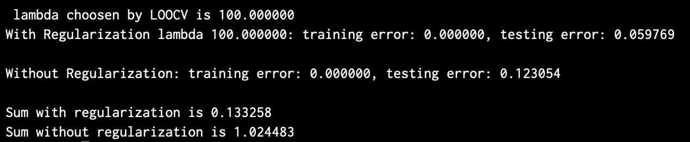
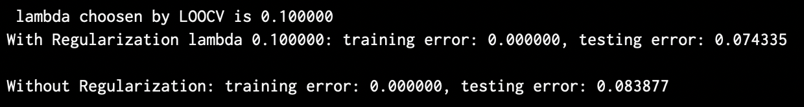

## Assignment2
---

### 1. A Walk Through Linear Models

**(a) Perceptron**

- **(i)** 

&nbsp;&nbsp;&nbsp;&nbsp;Since the data generated in `mkdata.py` is linear seperable, so that the perceptron algorithm will converge finally, that's to say the train error is **0** theoretical. 
&nbsp;&nbsp;&nbsp;&nbsp;To generate test data and train data, I fit `Ttrain + Ttest` into `mkdata`, then through slice for `X and y` to get `X_train X_test y_train y_test`.
&nbsp;&nbsp;&nbsp;&nbsp;The following is my results :

    -> When the number of training set is 10, the training error rate 
       is 0, and the testing error rate is 0.11132
    -> When the number of training set is 100, the training error rate
       is 0, and the testing error rate is 0.01377

<br>

- **(ii)**

    - When the number of training set is `10`, the average number of iterations before converge is `5.691`
    - When the number of training set is `100`, the average number of iterations before converge is `39.399`
<br>

- **(iii)**
&nbsp;&nbsp;&nbsp;&nbsp;As for the training data is not linear seperable situation, the most significant effect is that **the iteration loop is endless or the algorithm can't converge**, because the perceptron algorithm is trying to find parameters that can seperate the training data exactly. And in my program, I test it and find exactly that this program cell part is running endless.

<br>

**(b) Linear Regression**

- **(i)**
&nbsp;&nbsp;&nbsp;&nbsp;In this section, I also fit the `Ttrain + Ttest` into `mkdata` to get my training set and test set. The training error rate is `0.03819 or 3.819%`, the test error rate is `0.04694 or 4.694%`. And the linear-regression parameter is get from $\hat{\omega} = (XX^T)^{-1}Xy$, the implementing code is below:
```python
    X = np.insert(X, 0, values=np.ones((1, N)), axis=0) # add bias
    s = np.linalg.pinv(np.dot(X, X.transpose())) # (X X.T)^-1
    w = np.dot(np.dot(s, X), y.T) # * X * y
```

<br>

- **(ii)**
&nbsp;&nbsp;&nbsp;&nbsp;As for the situation that the training data is noisy, so the test data lable I use $y_{test} = \omega_f^T \cdot x_{test}$ to generate the test data lable, So that the test data has no noisy while the training data set remain some noisy. Then set `Ttrain = Ttest = 100`, I get that the `training error rate ` is **0.1309 or 13.09%**, the `testing error rate ` is **0.05809 or 5.809%**.

<br>

- **(iii)**
&nbsp;&nbsp;&nbsp;&nbsp;In this problem, first add bias term to both training set and testing set of X. Then to calculate `num_of_error` using $\omega^TXy < 0$ rule. Finally divide the `Ttrain(X.shape[1])` and `Ttest(X_test.shape[1])` to get final error rate of training set and testing set.
&nbsp;&nbsp;&nbsp;&nbsp;The result of `training error rate` is **0.49 or 49%**.
&nbsp;&nbsp;&nbsp;&nbsp;The result of `testing error rate` is **0.5496 or 54.96%**.

<br>

- **(iv)**
&nbsp;&nbsp;&nbsp;&nbsp;In this transformation problem, I first do the transform $(x_1, x_2) \to (x_1, x_2, x_1x_2, x_1^2, x_2^2)$, and then add the bias term to become like this $(1, x_1, x_2, x_1x_2, x_1^2, x_2^2)$, and in this way, I calculate out that the `training error rate` is **5% or 0.05**. The `testing error rate` is **6.6% or 0.066**. The implementing of transformation is like this:
```python
    X_t = np.row_stack((X, X[0, :] * X[1, :]))
    X_t = np.row_stack((X_t, np.power(X[0, :], 2)))
    X_t = np.row_stack((X_t, np.power(X[1, :], 2)))
    add_bias_xtrain = np.insert(X_t, 0, 
                            values=np.ones((1, X_t.shape[1])), 
                            axis=0)
```

<br><br>

**(c) Logistic Regression**

&nbsp;&nbsp;&nbsp;&nbsp;I followed the formula in the homework, which the y label is in $[0, 1]$. As we know that $p(y|x;\theta) = (h_\theta(x))^y(1-h_\theta(x))^{1-y}$, then we apply log-likelihood, the results is below:
$$
l(p(D)) = \sum_{i=1}^ny_i \ln h_\theta(x_i) + (1-y_i)\ln(1-h_\theta(x_i)) \tag{1}
$$
Then our target is to use gradient descent method to maximum this formula. I start from calculating the gradient of $\theta_j$ and then vectorization the updating formula to $\theta$.
$$
\begin{aligned}
\frac{\partial l(p(D))}{\partial \theta_j} &= \sum_{i=1}^n[y_i\frac{\partial \ln h_\theta(x_i)}{\partial \theta_j} + (1-y_i)\frac{\partial \ln(1-h_\theta(x_i))}{\partial \theta_j}] \\
&= \sum_{i=1}^ny_i\frac{1}{h_\theta(x_i)}\frac{\partial h_\theta(x_i)}{\partial \theta_j}+(1-y_i)\frac{1}{1-h_\theta(x_i)}(-\frac{\partial h_\theta(x_i)}{\partial \theta_j})
\end{aligned} \tag{2}
$$
$$
\begin{aligned}
\frac{\partial h_\theta(x_i)}{\partial \theta_j} &= \frac{\partial (\frac{1}{1+e^{-\theta^Tx_i}})}{\partial \theta_j} = \frac{e^{-t}}{(1+e^{-t})^2}\cdot x_i^j \tag{3}  
\end{aligned}
$$
Then we can take $(3)$ to $(2)$, we can get that:
$$
\begin{aligned}
\frac{\partial l(p(D))}{\partial \theta_j} &= \sum_{i=1}^n\frac{\partial h_\theta(x_i)}{\partial \theta_j}[\frac{y_i}{h_\theta(x_i)}-\frac{1-y_i}{1-h_\theta(x_i)}] \\
&= \sum_{i=1}^n\frac{e^{-t}}{(1+e^{-t})^2}\cdot x_i^j[\frac{y_i}{h_\theta(x_i)}-\frac{1-y_i}{1-h_\theta(x_i)}] \\
&= \sum_{i=1}^nx_i^j[y_i-y_ih_\theta(x_i) - h_\theta(x_i) + y_ih\theta(x_i)] \\
&= \sum_{i=1}^nx_i^j(y_i-h_\theta(x_i)) \tag{4}
\end{aligned}
$$
So that from formula $(4)$, and I denote $\lambda$ as learning rate, then I can get the updating formula for parameters $\theta$, and remember that our target is to `maximum` the likelihood, so **instead of deceasing the gradient**, we should **add the gradient** in one iteration step:
$$
\theta_{m+1} = \theta_m + \lambda\sum_{i=1}^n x_i(y_i-h_\theta(x_i)) \tag{5}
$$
Or we can rewrite $(5)$ to gradient descent form:
$$
\theta_{m+1} = \theta_m - \lambda\sum_{i=1}^nx_i(h_\theta(x_i)-y_i) \tag{6}
$$
&nbsp;&nbsp;&nbsp;&nbsp;In my solution, the implementing code for updating is below:
```python
    for i in range(0, num_iters):
        derive_array = np.sum(np.multiply(X, y - Sigmoid(w, X)), axis=1)
        derive_array = derive_array[:, np.newaxis]
        w = w + learning_rate * derive_array
```
&nbsp;&nbsp;&nbsp;&nbsp;And I implement the Sigmoid function:
```python
    def Sigmoid(w, X):
        s = 1.0 + np.exp(-np.dot(w.T, X))
        return 1.0/s
```

- **(i)**
&nbsp;&nbsp;&nbsp;&nbsp;Because the label has changed to $[0, 1]$, so in the training procedure, I use `adjust_y = np.maximum(y_train, 0)` to transform all the `-1` label to `0`. And use the `adjust_y` to training the parameters $\omega$.
&nbsp;&nbsp;&nbsp;&nbsp;In calculating error rate procedure, I get the learned parameter `w_g`, I still use the origin label data `y_train and y_test with label {-1, 1}`, because in this way can simply judge whether misclassified through $\omega^TXy < 0$.
&nbsp;&nbsp;&nbsp;&nbsp;So after the description for logistic function, I fit the data into function `logistic` and get learning parameters `w_g`, and I generate training set and testing set together, then split them using slice method. Set learning rate $\lambda = 0.1, iters = 100, ntest = 100, ntrain = 100 $, I get this result:

        When the size of training set is 100, the training error is 0.0088,
        and the testing error is 0.0152.

<br>

- **(ii)**
&nbsp;&nbsp;&nbsp;&nbsp;In the noisy situation, I get my result as: the **training error rate** is `12.59% or 0.1259`, and the **testing error rate** is `4.936% or 0.04936`.

<br>

**(d) Support Vector Machine**
&nbsp;&nbsp;&nbsp;&nbsp;In the Support Vector Machine part, I use the `scipy.optimize.minimize` function to calculate the minimum function of $\frac{1}{2}||\omega||^2$ with constraints $\forall_{i\in D}y_i(\omega^Tx_i + b) \geqslant 1 \iff \forall_{i\in D}y_i(\omega^Tx_i + b) - 1 \geqslant 0$. So I denote two function to calculate these two terms:
```python
def func(w):
    return 0.5 * (np.linalg.norm(w) ** 2)

def cons(w, X, y):
    P, N = X.shape
    w = w.reshape(P, 1)
    s_array = y * np.dot(w.T, X)
    return (np.min(s_array) - 1)
```
&nbsp;&nbsp;&nbsp;&nbsp;Then fit into the minimize function, and this function will do iterations automatically for us to find the minimum, and return the parameters it find. The main code is below:
```python
X = np.insert(X, 0, values=np.ones((1, N)), axis=0)  # add bias
res = optimize.minimize(func, w, 
constraints={"fun" : cons, "type" : "ineq", "args" : (X, y)}, 
            method='SLSQP', options={'maxiter': 200})
w = (res.x)[:, np.newaxis] # return to dim 2
```
&nbsp;&nbsp;&nbsp;&nbsp;As to find the support vectors, we know that if one point belong to support vectors, in theoretical $y_i(\omega^Tx_i+b) = 1$, but there will be some bias in real situation. So I soft this to $y_i(\omega^Tx_i+b) \leqslant 1.01$. If one point fit this rule, I regard this point as one point of support vectors.

- **(i)**
&nbsp;&nbsp;&nbsp;&nbsp;Following above rules, when `ntrain = 30, ntest = 100, reps = 1000`, the **training error rate** is `0.0`, the **testing error rate** is `0.03557 or 3.557%`.

<br>

- **(ii)**
&nbsp;&nbsp;&nbsp;&nbsp; Change the input with `ntrain = 100, ntest = 100, reps = 1000`, the **training error rate** is `0.0001 or 0.01%`, the **testing error rate** is `0.01015 or 1.015%`.

<br>

- **(iii)**
&nbsp;&nbsp;&nbsp;&nbsp;Use the rule I mentioned above, I get that the avgnum of support vectors for `ntrain = 100` is **3.783**.

---

### 2. Regularization and Cross-Validation

`Note: As for the speed, this part I use matlab instead of python to do programming.`

&nbsp;&nbsp;&nbsp;&nbsp;Before we run our algorithm, we first to do some preprocessing called feature normalization so that every feature with zero mean and unit variance. Remember that every column of the x_matrix represents one feature in all dataset. So I apply this formula to do normalization: $\hat{x} = \frac{x - mean(x)}{\sigma}$, and the implementing method is below, and to avoid divide 0 situation, I add eps to std_matrix to avoid this situation:
```matlab
std_matrix = std(X, 0, 2) + eps; % add eps avoid 0 situation
X = (X - mean(X, 2)) ./ std_matrix;
```

<br>

&nbsp;&nbsp;&nbsp;&nbsp;And for implementing LOOCV we choose one column of X and corresponing y out as validation. Then add the wrong case number as the decision rule for $\lambda$.
```matlab
for j = 1:size(X, 2)
    X_ = X(:, [1 : j - 1, j + 1 : size(X, 2)]);
    y_ = y(:, [1 : j - 1, j + 1 : length(y)]); % take point j out of X
    w = ridge(X_, y_, lambdas(i));
    E_val = E_val + (w' * [ones(1, 1);X(:, j)] * y(j) < 0);
end
```

<br>

**(a) Implement Ridge Regression**

- **(i)**
&nbsp;&nbsp;&nbsp;&nbsp;In ridge regression, the parameters $\omega$ is training through this formula: $\omega = (XX^T + \lambda I)^{-1}Xy$. 
&nbsp;&nbsp;&nbsp;&nbsp;The procedure to choose $\lambda$ is to calculate error number with LOOCV of each $\lambda \in lambdas$, after training process, I find that both $\lambda = 100$ and $\lambda = 1000$ get the best result $E_{val} = 7$ for `200` training set. Finally I choose **$\lambda = 100$** as the result of LOOCV. The whole code can see `validation.m`.
&nbsp;&nbsp;&nbsp;&nbsp;Although This part is **running very slow** due to the matrix operations. Maybe using gradient descent will be faster than using optimal formula to parameters.

<br>

- **(ii)**
&nbsp;&nbsp;&nbsp;&nbsp;The value for $\sum_{i=1}^m\omega_i^2$ is shown below:

    - `0.133258` with regularization with $\lambda = 100$.
    - `1.024483` without regularization with $\lambda = 0$.

<br>

- **(iii)**
&nbsp;&nbsp;&nbsp;&nbsp;The error rate is shown in below table:

|     | Without Regularization | With Regularization |
| :-: | :--------------------: | :-----------------: |
| Training error | 0.0% | 0.0%                   | 
| Testing error | 12.3054% | 5.9769% |



<br>

**(b) Implement Logistic Regression with regularization**
&nbsp;&nbsp;&nbsp;&nbsp; This part I still use the previous form of logistic MLE formula and add reguralization term $\lambda\sum_{i=1}^n \theta_i^2$ and denote $r$ as learning rate. So using gradient descent I get the new updating formula, this is in y_label {0, 1}:
$$
\theta_{m+1} = \theta_m - r[\sum_{i=1}^nx_i(h_\theta(x_i)-y_i) + 2\lambda\theta_m]
$$

&nbsp;&nbsp;&nbsp;&nbsp; The implementing code is in `logistic_r.m`:
```matlab
for i = 1:num_iters
    w = w - learning_rate * (sum(X .* (Sigmoid(w, X) - y), 2) ...
    + 2 * lambda * w);
end
```

&nbsp;&nbsp;&nbsp;&nbsp; **Note:** In training process, I use y label {0, 1}, when computing error rate I use y label {-1, 1}, because can easily judge by $\omega^Txy<0$ if it's a wrong case.

<br>

&nbsp;&nbsp;&nbsp;&nbsp; Implementing code is in `validation_logistic_r.m`.
&nbsp;&nbsp;&nbsp;&nbsp; The $\lambda$ choosen by LOOCV is `0.1`.
&nbsp;&nbsp;&nbsp;&nbsp; The error rate is shown in below table:

|     | Without Regularization | With Regularization |
| :-: | :--------------------: | :-----------------: |
| Training error | 0.0% | 0.0%                   | 
| Testing error | 8.3877% | 7.4335% |



---

<br>
<br>

### 3. Bias Variance Trade-off
- **(i)**
&nbsp;&nbsp;&nbsp;&nbsp; `False.` Adding more training examples does little effect on high bias problem, while to high variance problem the testing error will go high.

<br>

- **(ii)**
&nbsp;&nbsp;&nbsp;&nbsp; `False.` First the high variance algorithm will lead to overfitting problem when training number is smaller than the features. And perhaps perform even worse in testing set.

<br>

- **(iii)**
&nbsp;&nbsp;&nbsp;&nbsp; `True.` With more parameters the model will go more complex, then get higher variance. And when the training set is small, it will lead to overfitting problem. So this statement is true.

<br>

- **(iv)**
&nbsp;&nbsp;&nbsp;&nbsp; `False.` The regularization paramater $\lambda$ is also very important. Consider that if the $\lambda$ is very large, the parameters $\omega$ will become nearly to 0. The model will become worse in many cases.

<br>

- **(v)**
&nbsp;&nbsp;&nbsp;&nbsp; `False.` Just like the description above, a large $\lambda$ may cause the parameter $\omega$ bearly to 0. In most cases this does hurt your model's performance.