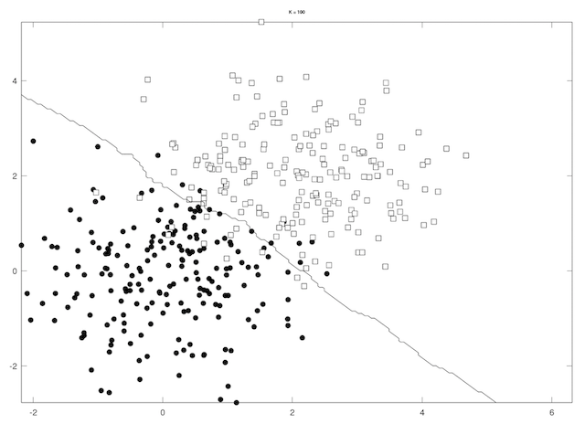
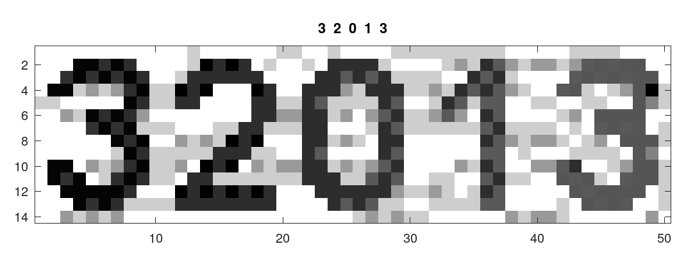
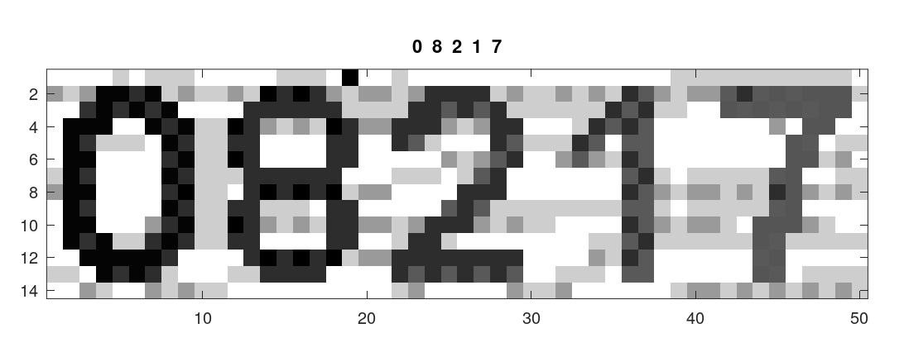

### Assignment3

---

#### 1. Neural Networks

&nbsp;&nbsp;&nbsp;&nbsp;&nbsp;**（1）fullyconnect_feedforward**: In this section we need to implement the feedforward for fullyconnect layer. The input parameters is `in, weight, bias`, this process is simply multiply the `in` and `weight`, and remember to add the bias for every image, so the implementing code is below, also can see in `fullyconnect_feedforward.m`:
```matlab
function [out] = fullyconnect_feedforward(in,  weight, bias)
%The feedward process of fullyconnect
%   input parameters:
%       in      : the intputs, shape: [number of images, number of inputs]
%       weight  : the weight matrix, 
%                 shape: [number of inputs, number of outputs]
%       bias    : the bias, shape: [number of outputs, 1]
%
%   output parameters:
%       out     : the output of this layer, 
%                 shape: [number of images, number of outputs]

% TODO
out = in * weight;
for i=1:size(out, 1)
    out(i, :) += bias';
end
end
```

<br>

&nbsp;&nbsp;&nbsp;&nbsp;&nbsp;**(2) relu_feedforward:** In this section we need to implement the relu layer. We know that the relu representation is $relu(x) = max(0, x)$, so I simply transform all the value which is minus to 0. The implementing code is below, also can see in `relu_feedforward.m`:
```matlab
function [ out ] = relu_feedforward( in )
%The feedward process of relu
%   inputs:
%           in	: the input, shape: any shape of matrix
%   
%   outputs:
%           out : the output, shape: same as in

% TODO
    tmp = in;
    tmp(tmp < 0) = 0;
    out = tmp;
end
```

<br>

&nbsp;&nbsp;&nbsp;&nbsp;&nbsp;**(3) fullyconnect_backprop:** In this section we need to implement the fullyconnect layer for backprop process. The input is `in_sensitive, in, weight`, the output is `weight_grad, bias_grad, out_sensitivity`, in BP algorithm, $\frac{\partial net_k}{\partial \omega_{kj}} = y_j$, so the `weight_grad` can simply get from `in * in_sensitive / num_of_images`, and since the bias terms is 1, so the `bias_grad` can get from `sum(in_sensitive) / num_of_images`, then for `out_sensitivity`, this is get from multiply the in_sensitive and weight, that is to say `out_sensitivity = in_sensitivity * weight`. So the implementing is below, also can see in `fullyconnect_backprop.m`:
```matlab
number_of_images = size(in_sensitivity, 1);
weight_grad = in' * in_sensitivity / number_of_images;

bias_grad = (sum(in_sensitivity))' / number_of_images;

out_sensitivity = in_sensitivity * weight';
```

<br>

&nbsp;&nbsp;&nbsp;&nbsp;&nbsp;**(4) relu_backprop:** In this section, we know before that $relu(x) = max(0, x)$, so in the BP procedure, the propagation is that:
$$
\begin{cases}
    in < 0 \implies relu_{grad} = 0 \\
    in > 0 \implies relu_{grad} = 1 \\
\end{cases}
$$

Then `out_sensitivity = relu_grad .* in_sensitivity`. The implementing code is below, and also can see in `relu_backprop.m`:
```matlab
function [out_sensitivity] = relu_backprop(in_sensitivity, in)
%The backpropagation process of relu
%   input paramter:
%       in_sensitivity  : the sensitivity from the upper layer, shape: 
%                       : [number of images, number of outputs in feedforward]
%       in              : the input in feedforward process, 
%                         shape: same as in_sensitivity
%   
%   output paramter:
%       out_sensitivity : the sensitivity to the lower layer, 
%                         shape: same as in_sensitivity

% TODO
relu_grad = in;
relu_grad(relu_grad < 0) = 0;
relu_grad(relu_grad > 0) = 1;
out_sensitivity = relu_grad .* in_sensitivity;
end
```

<br>

&nbsp;&nbsp;&nbsp;&nbsp;&nbsp;**(5) Gradient check:** This part I do gradient check in the code folder, and get the result below, which shows that the gradient calculation is correct:<br>


<br>

&nbsp;&nbsp;&nbsp;&nbsp;&nbsp;**(6) Results:** This section I will show the result of my implementing algorithm, after running my algorithm, I get that `loss = 0.2487, accuracy = 0.931`. You can simply run the `run.m` and see the result.

<br>

---

#### 2. K-Nearest Neighbor

**(a)**
&nbsp;&nbsp;&nbsp;&nbsp;&nbsp; First I implement the knn algorithm using professor DengCai's `EuDist2.m` code. First get the distance matrix, and then find the k nearest point using `sort` built-in function, we just need to find the first k index. Then using the `mode` built-in function to find the predicted label here. So the implementing for knn is below, also can see in `knn.m`:
```matlab
function y = knn(X, X_train, y_train, K)
%KNN k-Nearest Neighbors Algorithm.
%
%   INPUT:  X:         testing sample features, P-by-N_test matrix.
%           X_train:   training sample features, P-by-N matrix.
%           y_train:   training sample labels, 1-by-N row vector.
%           K:         the k in k-Nearest Neighbors
%
%   OUTPUT: y    : predicted labels, 1-by-N_test row vector.
%

% YOUR CODE HERE
dist_matrix = EuDist2(X', X_train');
[Y, idx] = sort(dist_matrix, 2);
idx_k = idx(:, 1:K);
if(K == 1)
    y = y_train(idx_k);
else
    y = mode(y_train(idx_k), 2)';
end
end
```

&nbsp;&nbsp;&nbsp;&nbsp;&nbsp; After implementing knn algorithm, I use the `knn_exp.m` to plot the result, shown below:

- k = 1


<br>

- k = 10


<br>

- k = 100


<br>

**(b)**
&nbsp;&nbsp;&nbsp;&nbsp;&nbsp; In my view, we can split the training data into training data and test set, try many k values and use cross-validation method to calculate the accuracy which k is giving the best result. The k value should as big enough to avoid noisy, generally, we denote `N` as number of sample set, $\sqrt{N}$ will be a good choice, and then test the around many k values, select k value which performs the highest accuracy on testing-set.

<br>

**(c)**
&nbsp;&nbsp;&nbsp;&nbsp;&nbsp; In this section I prepared 20 training samples in `TrainingSet` folder you can find them. And 5 testing samples in `TestSet` folder. The `labeling` process is in `label_data.m` and save the data in `hack_data.mat`. Then implement the code in `hack.m` and set `K = 3`:
```matlab
function digits = hack(img_name)
%HACK Recognize a CAPTCHA image
%   Inputs:
%       img_name: filename of image
%   Outputs:
%       digits: 1x5 matrix, 5 digits in the input CAPTCHA image.

load('hack_data');
% YOUR CODE HERE
Xtest = extract_image(img_name);
digits = knn(double(Xtest), double(X), double(y), 3);
end
```

&nbsp;&nbsp;&nbsp;&nbsp;&nbsp; The main processing code is in `run.m`, you can run this program and see the knn's performance in testing set, I run it and get the results below, it can recognize all correctly!

- (1)

<div align="center">
    
</div>

- (2)

<div align="center">
    
</div>

- (3)

<div align="center">
    
</div>

- (4)

<div align="center">
    
</div>

- (5)

<div align="center">
    
</div>

---

<br>

#### 3. Decision Tree and ID3

&nbsp;&nbsp;&nbsp;&nbsp;&nbsp; In this section we gonna to implement the ID3 algorithm, and we know that $Entropy(S) = -\sum_{i=1}^cp_i\log p_i$, and $Gain(S) = Entropy(S) - \sum_{v\in values(a)}\frac{|S_v|}{|S|}Entropy(S_v)$, from this we know that:
$$
\begin{aligned}
    Entropy(S) &= -(\frac{200}{450}\log \frac{200}{450} + \frac{250}{450}\log \frac{250}{450}) \\
    &= -(\frac{4}{9}\log \frac{4}{9} + \frac{5}{9}\log \frac{5}{9}) \\
    &= 0.991076 \tag{0}
\end{aligned}
$$
$$
\begin{aligned}
    Gain(GPA) &= Entropy(S) - [\frac{215}{450}Entropy(low) + \frac{235}{450}Entropy(high)] \\
    &= 0.4266983519911507 \tag{1}
\end{aligned}
$$
$$
\begin{aligned}
    Gain(gender) &= Entropy(S) - [\frac{205}{450}Entropy(F) + \frac{245}{450}Entropy(M)] \\
    &= 0.011233324824869495 \tag{2}
\end{aligned}
$$

&nbsp;&nbsp;&nbsp;&nbsp;&nbsp; According to the results, we can see that feature GPA's Gain is higher than gender, that is $Gain(GPA) > Gain(gender)$, so the root of decision tree we will use the GPA, the second layer is gender, so the decision tree is drawn below:

<div align="center">
    
</div>

---

#### 4. K-Means Clustering
&nbsp;&nbsp;&nbsp;&nbsp;&nbsp;First we need to implement the kmeans algorithm here. First random select k points to be centers from the dataset. Then to label every point in the dataset by selecting the smallest distance from the nearest center. Then iteratively update the centers until have no changes any more. The implementing code is below, also can see in `kmeans.m`:
```matlab
function [idx, ctrs, iter_ctrs] = kmeans(X, K)

% YOUR CODE HERE
vector = randperm(size(X, 1), K);
ctrs = ones(K, size(X, 2));
for i=1:K
    ctrs(i, :) = X(vector(i), :);
end
iter_ctrs = ctrs;
idx = zeros(size(X, 1), 1);

while(true)
    dist_matrix = EuDist2(X, ctrs);
    [Y, idx_k] = min(dist_matrix, [], 2);
    current_idx = idx_k;
    if current_idx == idx
        break;
    end
    idx = current_idx;

    for i=1:K
        ctrs(i, :) = mean(X(idx == i, :), 1);
    end
    iter_ctrs = cat(3, iter_ctrs, ctrs);
end
end
```
<br>

**(a)**
&nbsp;&nbsp;&nbsp;&nbsp;&nbsp;I run the kmeans algorithm 1000 times, I plot the figure with largest SD and smallest SD, the process code is in `show_kmeans_SD.m`, the result plots is below:

- largest SD:

<div align="center">
    
</div>

- smallest SD:

<div align="center">
    
</div>

<br>

**(b)**
&nbsp;&nbsp;&nbsp;&nbsp;&nbsp;We can run kmeans algorithm for many times and then select the best result from all the result data, the result may be more stable than just one time kmeans algorithm run.

<br>

**(c)**
&nbsp;&nbsp;&nbsp;&nbsp;&nbsp;After running the process code, I get the result plots below, and you can see that kmeans algorithm can discover the pattern without any label information, you can also find it in `show_kmenas_digits.m`:

- k = 10:


- k = 20:


- k = 50:


<br>

**(d)**
&nbsp;&nbsp;&nbsp;&nbsp;&nbsp;I implement the `vq.m` and you can find the result images in `Result_images` folder which contains the result plot for `k = 8, 16, 32, 64` compressing results. The compressed results are below:

- k = 8:

<div align="center">

</div>

- k = 16:

<div align="center">

</div>

- k = 32:

<div align="center">

</div>

- k = 64:

<div align="center">

</div>

<br>
<br>

&nbsp;&nbsp;&nbsp;&nbsp;&nbsp;As for the compressing ratio:
$$
ratio = \frac{3 * 8}{\log K} = \frac{24}{\log K} = \frac{24}{\log64} = \frac{24}{6} = 4
$$
&nbsp;&nbsp;&nbsp;&nbsp;&nbsp;So the compressing ratio when `K = 64` is `4:1.`