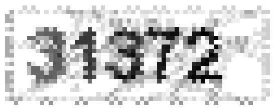
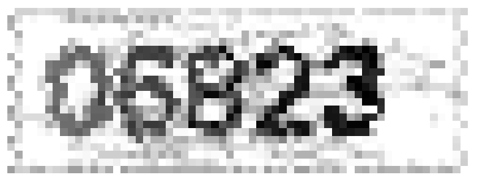

### Assignment4

---

#### 1. Spectral Clustering

&nbsp;&nbsp;&nbsp;&nbsp;&nbsp;Before we do the following tasks, we need to implement the spectral clustering algorithm before. The implementing procedure for the algorithm is very simple, the algorithm can be done by these steps:
1. From distance matrix `W` form matrix `D`, which is a diag matrix and each value in diagonal is the sum of each row of `W`.
2. Then solve the general eigen problem for matrix `D - W` and `W`.
3. Select the second smallest eigen value and coresponding eigen vector `y`.
4. Perform kmeans algorithm on vector `y`.
&nbsp;&nbsp;&nbsp;&nbsp;&nbsp;So the main code is below, you can also see in `spectral_clustering/spectral.m`:
```matlab
sum_w_matrix = sum(W, 2);
D = zeros(size(W));
% form matrix D
D(logical(eye(size(D)))) = sum_w_matrix;
[y_matrix, value_matrix] = eig(D - W, D);
y = y_matrix(:, 2); % second smallest eigen vector
idx = litekmeans(y, k); % perform kmeans
```

<br>

- **(a)**
&nbsp;&nbsp;&nbsp;&nbsp;&nbsp; In this part we will experiment spectral clustering on synthesis data. First we need to construct the knn-graph. The thoughts also very direct, we first calculate the distance by `EuDist2.m` in matrix `W`. Then for every data point we select the k closest points out, this we can sort and find the kth min distance for every point and corresponding index to form a vector, then we can easily find all data-points' knn neighbors using `W < vec`.
&nbsp;&nbsp;&nbsp;&nbsp;&nbsp; Also we need to filter the very far points since we only need to focus the local connectivity, so we also need to consider the threshold for point's distance. This problem I select one proper threshold is `0.6` and the neighbor I select for knn-graph is `300`. They work fine in the result so I choose these.
&nbsp;&nbsp;&nbsp;&nbsp;&nbsp; The implementing is below, you can also find in `spectral_clustering/knn_graph.m and kmin_vector.m`:
```matlab
function vec = kmin_vector(D, k)
    [Y, idx] = sort(D);
    vec = Y(k, :);
end

function W = knn_graph(X, k, threshold)
    distance_matrix = EuDist2(X);
    vec = kmin_vector(distance_matrix, k);
    W = distance_matrix <= vec;
    % filter threshold
    W = W & (distance_matrix <= threshold);
    W = W | W'; % make symmetric matrix
end
```

<br>

&nbsp;&nbsp;&nbsp;&nbsp;&nbsp; **Results shown:** You will clearly to find that spectral clustering performs better than kmeans in this situation!

- Spectral clustering:
<div align="center">
    
</div>

<br>

- Kmeans:
<div align="center">
    
</div>

<br>

- **(b)**
&nbsp;&nbsp;&nbsp;&nbsp;&nbsp; This part we try spectral clustering on real-world data. The main task we need to do is to compare the performance of kmeans and spectral clustering on real world data. There are two evaluation indicators: accuracy and normalized mutual information. **The higher accuracy and normalized mutual information means that the clustering algorithm performs better.**
&nbsp;&nbsp;&nbsp;&nbsp;&nbsp; So we gonna to implement all these. I follow [Matlab codes for clustering](http://www.cad.zju.edu.cn/home/dengcai/Data/Clustering.html) ways to calculate the accuracy and normalized mutual information. The main ways is below:
```matlab
res = bestMap(gnd,res);
%==  evaluate AC: accuracy ==
AC = length(find(gnd == res))/length(gnd);
%==  evaluate MIhat: nomalized mutual information ==
MIhat = MutualInfo(gnd,res);
```

<br>

&nbsp;&nbsp;&nbsp;&nbsp;&nbsp; For kmeans, I use the professor Dengcai's `litekeans.m` to do kmeans algorithm. For spectral I use the `constructW.m` and set `options.NeighborMode = 'KNN';
    options.k = 7;
    options.WeightMode = 'Binary';` I try `20` times for the loop, and get the final results, you can find the code in `spectral_exp2.m`:

- kmeans: accuracy = **0.5059**, mutual information = **0.3852**
- spectual: accuracy = **0.8332**, mutual information = **0.5261**

<div align="center">
    
</div>

<br>

---

<br>

#### 2. Principal Component Analysis
&nbsp;&nbsp;&nbsp;&nbsp;&nbsp; Also before all tasks, we need to implement the PCA algorithm. The implementing procedure is below:
1. Calculate the covariance matrix of data, just simply by matlab builtin function `S = cov(data)`.
2. Calculate the eigen values and eigen vectors of matrix `S`.
3. Sort the eigen vectors by the descending order of eigen values. Every eigen vector is called one principal component.
```matlab
function [eigvector, eigvalue] = pca(data)
    % calculate cov matrix of data
    S = cov(data);
    [vectors, value] = eig(S);
    % make value vectors
    value = sum(value, 2);
    % sorting by descend
    [value, idx] = sort(value, 'descend');
    eigvector = vectors(:, idx);
    eigvalue = value;
end
```

<br>

- **(a)**
&nbsp;&nbsp;&nbsp;&nbsp;&nbsp; In this part we gonna to use the pca algorithm to hack some rotated images for us. The main thoughts as for me is below:
1. Find out the non background color pixel by `[x, y] = find(img_r < 255);`
2. Then use the coordinate x, y as the feature of one data point.
3. Perform pca on data points and get the eigen vectors.
4. Do transformation by `project_pos = data * eigvectors;` and `ceil` to be int value here. And then make the coordinates all positive by minus the minimum value of project_x and project_y, do not forget to add `1` for some positions will be `0` and this will lead to bugs when you try to put some value on the transformed position.
5. Then form a mapping from origin coordinates to the project coordinates, copy the corresponding pixel value to project position, then show the images.
```matlab
function img = hack_pca(filename)
    img_r = double(imread(filename));
    % here use position in image to represent features
    % filter non background piexls
    [x, y] = find(img_r < 255);
    data = [x, y];
    [eigvectors, eigvalues] = pca(data);
    project_pos = data * eigvectors;
    project_pos = ceil(project_pos);
    % normalize
    project_pos = project_pos - min(project_pos, [], 1) + 1;
    new_image = ones(size(img_r)) * 255;

    for i=1:size(project_pos, 1)
        row_origin = data(i, :);
        row_project = project_pos(i, :);
        new_image(row_project(2), row_project(1)) = img_r(row_origin(1), row_origin(2));
    end
    new_image = flipud(uint8(new_image));
    figure;
    imshow(new_image);
end
```

&nbsp;&nbsp;&nbsp;&nbsp;&nbsp; Then you can run the `show_rotate.m` written by me show the final results:

- 1.gif:
<div align="center">
    
</div>

<br>

- 2.gif
<div align="center">
    
</div>

<br>

- 3.gif
<div align="center">
    
</div>

<br>

- 4.gif
<div align="center">
    
</div>

<br>

- 5.gif
<div align="center">
    
</div>

<br>
<br>

- **(b)**
- **(i)**
&nbsp;&nbsp;&nbsp;&nbsp;&nbsp;The eigen faces shown below:
<div align="center">
    
</div>

<br>

- **(ii)**
&nbsp;&nbsp;&nbsp;&nbsp;&nbsp; The procedures for this task is:
1. First perform PCA on `fea_train` to get the eigen vectors and eigen values.
2. According to the choosen dimension `k` to select the first `k` eigen vectors to form transformation matrix.
3. Multiply the transformation matrix with `fea_train` and `fea_test` to get `low_dim_train` and `low_dim_test`.
4. Perform knn with `low_dim_test`, `low_dim_train`, `gnd_train` and `k = 1` to get the `predict_test`.
5. Using the `predict_test` and `gnd_test` to calculate the accuracy.
6. Then using $\check{X} = A(A^TX)$ to reconstruct the image and show_face. This part code you can see in `pca_exp1.m`.
```matlab
load('ORL_data', 'fea_Train', 'gnd_Train', 'fea_Test', 'gnd_Test');
% 1. Feature preprocessing
[num_train, num_featrues] = size(fea_Train);
[num_test, num_featrues] = size(fea_Test);
% 2. Run PCA
[eigenvectors, eigenvalues] = pca(fea_Train);
% 3. Visualize eigenface
show_face(eigenvectors');
show_face(fea_Train);
% 4. Project data on to low dimensional space
reduced_dim = [8, 16, 32, 64, 128];
% 5. Run KNN in low dimensional space
for i=1:length(reduced_dim)
    current_dim = reduced_dim(i);
    transform_matrix = eigenvectors(:, 1:current_dim);
    low_dim_train = fea_Train * transform_matrix;
    low_dim_test = fea_Test * transform_matrix;

    predict_test = knn(low_dim_test', low_dim_train', gnd_Train', 1);
    predict_test = predict_test';
    correct_num = sum(predict_test == gnd_Test);

    fprintf("For dim %d,the testing error rate is %f\n", 
        current_dim, 
        1 - (correct_num / num_test));

    figure;
    % reconstruction
    show_face(low_dim_train * transform_matrix');
end
```

- origin image:

<div align="center">
    
</div>

<br>

- dimension 8:
<div align="center">
    
</div>

<br>

- dimension 16:
<div align="center">
    
</div>

<br>

- dimension 32:
<div align="center">
    
</div>

<br>

- dimension 64:
<div align="center">
    
</div>

<br>

- dimension 128:
<div align="center">
    
</div>

<br>
&nbsp;&nbsp;&nbsp;&nbsp;&nbsp; And the results for testing error is shown below:
<div align="center">

| Dimension | Testing error |
| :-------: | :-----------: |
| 8 | 0.245 |
| 16 | 0.2 |
| 32 | 0.18 |
| 64 | 0.15 |
| 128 | 0.15 |

<br>


</div>

<br><br><br><br>

&nbsp;&nbsp;&nbsp;&nbsp;&nbsp; Additional, I also tried LDA in this task by professor Dengcai's code `LDA.m` to implement this algorithm. The main procedure is same as above, only change from PCA to LDA to get transformation matrix. These are the results for LDA performance, you will see the significant performance for LDA algorithm (you can see the code in `pca_exp2.m`):

<div align="center">

| Dimension | Testing error |
| :-------: | :-----------: |
| 8 | 0.215 |
| 16 | 0.115 |
| 32 | 0.065 |
| 39 | 0.055 |


</div>